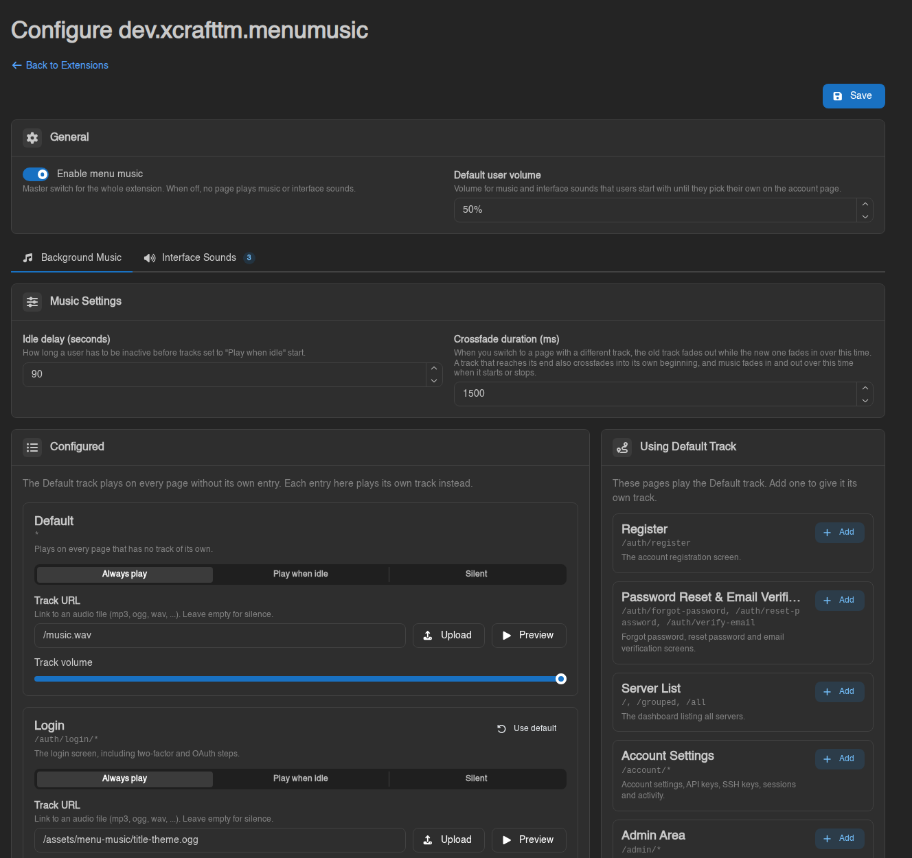
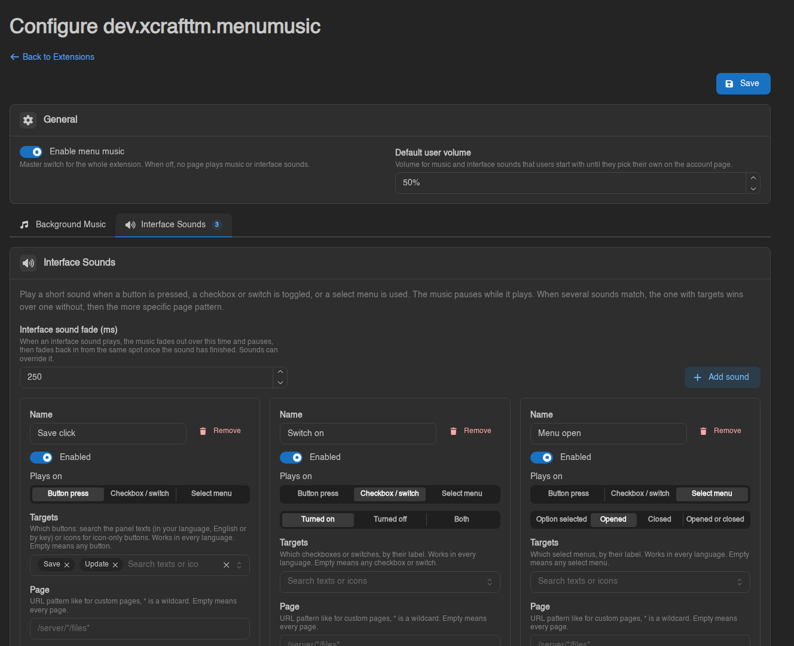
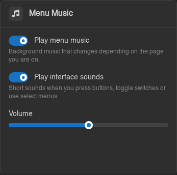
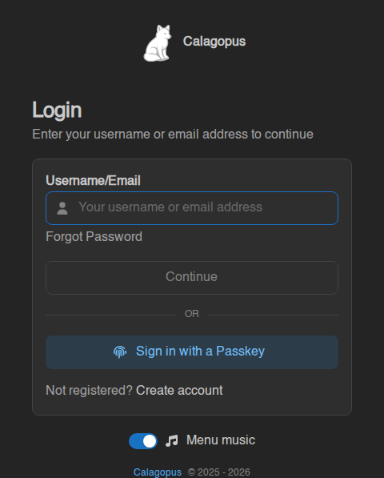

<div align="center">

# 🎵 Menu Music

**Background music and interface sounds for the [Calagopus](https://calagopus.com) panel.**

Give your panel a soundtrack: a theme for the login screen, another for the server list, calm ambience while
someone works on a server, smooth crossfades between them, and little click sounds for buttons, switches and menus.

[](https://github.com/XCraftTM/CalagopusMenuMusic/releases/latest)




</div>

## ✨ Features

- 🎶 **A track for every page.** Login, register, server list, account, every server page, the admin area, or
  any URL you like (`/server/*/files*`). Pages without their own track play the Default track.
- 🔀 **Smooth crossfades.** Switching pages fades one track into the next, and tracks loop seamlessly by fading
  into their own beginning. If two pages share a track, it simply keeps playing.
- 💤 **Idle music.** Let a track start only after someone has been inactive for a while, and fade away as soon
  as they move the mouse again.
- 🔊 **Interface sounds.** Play a sound when a button is pressed, a switch is turned on or off, or a select menu
  is opened, closed or used. The music briefly fades out for the sound and picks up right where it left off.
- 🌍 **Works in every language.** Pick the "Save" button once and the sound also plays for a German user
  pressing "Speichern".
- 📁 **Your own files.** Upload audio straight from the settings page, pick files from the panel's Assets, or
  paste any link to an audio file.
- 🎧 **Users stay in control.** Everyone can turn music and sounds off or change the volume, even on the login
  screen.

## 📦 Installation

1. Download **`dev_xcrafttm_menumusic.c7s.zip`** from the [latest release](https://github.com/XCraftTM/CalagopusMenuMusic/releases/latest).
2. In your panel, go to **Admin → Extensions** and upload the file
   ([how to install extensions](https://calagopus.com/docs/panel/extensions/installing-extensions)).
3. Open **Admin → Extensions → Menu Music → Configure**.

> [!NOTE]
> Needs Calagopus **1.2.3 or newer** running the `:heavy` Docker image, which is the one that supports extensions.

## 🚀 Quick start

1. On the **Background Music** tab, give the **Default** track a song: **Upload** a file or pick one from your
   Assets. Press **Preview** to listen.
2. Want different music somewhere? Press **Add** next to a page on the right, or create a **Custom Page** from a
   URL pattern.
3. On the **Interface Sounds** tab, press **Add sound**. Choose what it plays on, then search for the button,
   switch or menu, e.g. "Save" or the trash icon.
4. Press **Save**, or <kbd>Ctrl</kbd>+<kbd>S</kbd>.

<div align="center">

</div>

## 👤 What your users see

<table>
  <tr>
    <td align="center" width="50%">
      <br>
      <sub>A <b>Menu Music</b> card on the Account page: music and sounds on/off, and a volume slider.</sub>
    </td>
    <td align="center" width="50%">
      <br>
      <sub>A small <b>Menu music</b> switch below the login form for visitors who aren't logged in.</sub>
    </td>
  </tr>
</table>

## ❓ Good to know

- **Why doesn't the music start right away?** Browsers don't allow websites to play sound before the visitor has
  interacted with the page. The music starts on the first click or key press, and nothing extra appears on screen.
- **Which file formats work?** Anything the visitor's browser can play. MP3, OGG, WAV and M4A all work in every
  modern browser.
- **Can I turn everything off quickly?** Yes, the **Enable menu music** switch at the top of the settings page
  turns off all music and sounds for everyone.
- **Does it work with themes?** Yes. The login switch is built to stay in place even with themes that heavily
  restyle the login page, like [qunix_theme](https://github.com/mrbeeenopro/qunix_theme).

---

## 🛠 Technical details

This part is for developers and curious admins. It explains how the extension works, not every setting.

### Overview

The extension has a small **Rust backend** and a **React frontend**, like every Calagopus extension.

- **Backend** (`src/`). The settings live in the panel's own extension settings store: simple values as one row
  each, tracks and sounds as JSON. Everything is validated on save and cleaned up again when loaded, so a
  hand-edited database or an older format can't break the frontend. There are two routes:
  - `GET /api/extensions/dev.xcrafttm.menumusic/config` is public. The login page needs it before anyone is
    logged in, and it only contains audio URLs and playback settings.
  - `GET` and `PUT /api/admin/extensions/dev.xcrafttm.menumusic/settings` need the `extensions.read` and
    `extensions.manage` admin permissions. Saving writes an entry to the admin activity log.
- **Frontend** (`frontend/src/`). It plugs into the panel through extension slots:
  - two invisible components on every page, one for the music and one for interface sounds;
  - the card on the Account page;
  - the switch below the login form;
  - the settings page.

### Which track plays

For the current URL, the extension checks in order:

1. **Custom pages.** If several patterns match, the most specific one wins (the one with the most non-wildcard
   characters).
2. **The built-in page** for that URL, if it has its own track.
3. **The Default track.**

`*` matches anything, and a pattern ending in `/*` also matches the path itself, so `/admin/*` matches `/admin`.

### The audio engine

The music runs on two `<audio>` elements, called decks, that take turns:

- **Changing tracks.** The new track starts on the idle deck while the other fades out. The fade uses an
  equal-power curve, so the volume doesn't dip in the middle.
- **Looping.** Shortly before a track ends, a fresh copy starts on the other deck and crossfades in. Tracks
  shorter than two crossfades use the browser's normal loop instead.
- **Pausing.** Pausing keeps the playback position, so idle music and ducked music continue where they stopped.
- **Autoplay blocking.** If the browser blocks playback, the player waits for the first click, tap or key press
  and then plays whatever the current page needs.
- **Ducking.** An interface sound fades the music out and pauses it while the sound plays, then fades it back in.
  If the page changes during a sound, the new track is queued and starts once the sound is over.

### How interface sounds find their buttons

Panel buttons have no IDs, so the extension recognizes elements by what the panel calls them internally:

- **Translation keys.** Almost every label in the panel comes from a translation key, like `common.button.save`.
  When something is clicked, the extension converts the visible text back into keys using the panel's
  translation table for the visitor's language, and compares those keys with the sound's targets. That's why one
  target works in every language. Labels with placeholders, like "Delete {name}", still match.
- **Icon names.** Icon-only buttons have no text, so they're matched by their icon name, like `trash`. The list
  of icons for the search box ships as a static file (`frontend/public/dev.xcrafttm.menumusic/icons.json`) that
  only the settings page downloads. Importing the icon packages directly would have added every icon to the
  panel's shared JavaScript bundle that all visitors load.
- **Detection.** One page-wide listener watches clicks and checkbox changes. A watcher on the
  `data-expanded` attribute of the panel's select inputs reports select menus opening and closing. Each button
  is identified when it's pressed, not only when the click lands, because some buttons change on press (the
  password field's eye icon becomes `eye-slash`).

### User preferences

The music switch, the sounds switch and the volume are stored as panel user settings under
`dev.xcrafttm.menumusic::muted`, `::sounds_muted` and `::volume`, so they follow the user across devices. A
copy is kept in the browser's local storage so the choice also applies on the login page, where no user is
logged in yet.

### Building

| What | How |
| --- | --- |
| Build the `.c7s.zip` | `python3 scripts/package.py` (Python 3.11+) writes `dist/dev_xcrafttm_menumusic.c7s.zip` |
| CI | Every push builds the zip and attaches it to the workflow run under **Artifacts** |
| Release | Push a tag like `v1.0.0` matching the version in `Cargo.toml`. CI attaches the zip to a GitHub release and uses that version's section from [`CHANGELOG.md`](CHANGELOG.md) as release notes |
| Refresh the icon list | `node scripts/generate-icons.mjs <panel>/frontend` after the panel updates its icon packages |
| Develop and test | Install the zip into a [development environment](https://calagopus.com/docs/panel/extensions/dev-environment) with `panel-rs extensions add`, then use the panel's [pre-export checks](https://calagopus.com/docs/panel/extensions/getting-your-extension-ready): `cargo clippy`, `cargo test -p dev_xcrafttm_menumusic`, `pnpm biome:validate` and `pnpm build:ci` |

### Project layout

```
src/                        Rust backend: settings model + validation, public and admin routes
frontend/src/
  elements/                 global music and sound components, account card, login switch
  pages/                    the settings page (tabs, track and sound editors, target search)
  lib/                      audio engine, interaction detection, URL matching, translation lookup
frontend/public/            static files served by the panel (the icon list)
scripts/                    packaging and icon list generation
```
